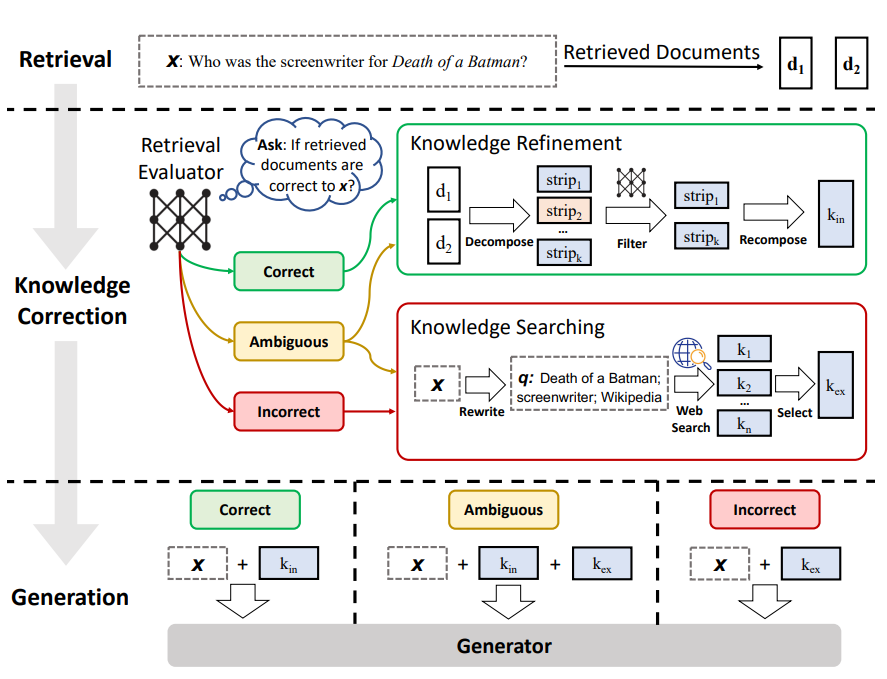

# corrective_RAG

An experimental Retrieval-Augmented Generation (RAG) workflow that builds an internal knowledge base from predefined URLs, retrieves context for a user question, grades retrieved documents for relevance, and if insufficient context is found automatically rewrites the query and falls back to a live web search (Tavily) before generating an answer with an OpenAI chat model.

## Key Features
- Automatic ingestion & chunking of web content into a Chroma vector store
- Retrieval of potentially relevant chunks based on a user query
- LLM-based document relevance grading (binary yes/no) to filter noise
- Adaptive decision: generate directly vs. rewrite & web search fallback
- Query rewriting to improve recall when initial retrieval is weak
- Web search integration via Tavily for fresh external knowledge
- Composed as a graph using `langgraph` for clarity and extensibility

## Architecture Overview



1. Load knowledge base pages listed in `agent_graph.py` (`KNOWLEDGE_BASE_URLS`).
2. Split documents into embeddings-ready chunks (`RecursiveCharacterTextSplitter`).
3. Store & embed chunks in **Chroma** using `OpenAIEmbeddings`.
4. Retrieve top-matching chunks for the question.
5. Grade each chunk with an LLM against the question (`GRADE_DOCUMENTS_PROMPT`).
6. If any relevant documents remain → generate answer using RAG prompt (`hub.pull('rlm/rag-prompt')`).
7. Else → rewrite the query (`QUESTION_REWRITER_PROMPT`) and perform Tavily web search.
8. Generate final answer from search results.

## Requirements
See `requirement.txt` (minimal set). Install with:
```bash
pip install -r requirement.txt
```

## Environment Variables
Create a `.env` file in the project root (NOT committed – see `.gitignore`). Example:
```
OPENAI_API_KEY=sk-...
TAVILY_API_KEY=tvly-...
```
Add any other provider keys as needed.

## Quick Start
```bash
python -m venv .venv
source .venv/bin/activate
pip install -r requirement.txt
cp .env.example .env  # (if you create one) then edit with real keys
python agent_graph.py
```
Expected output: console logs showing grading steps and a final "Agent Response".

## Usage
Change the initial question near the bottom of `agent_graph.py`:
```python
shared_state = compiled_graph.invoke({
    'question': "Explain Binary Heap?"
})
```
Or import and reuse the compiled graph in another script:
```python
from agent_graph import build_graph
workflow = build_graph()
result_state = workflow.invoke({'question': 'What are word embeddings?'})
print(result_state['agent_response'])
```

## Customization
- Add more seed URLs: edit `KNOWLEDGE_BASE_URLS` list.
- Adjust chunk size: modify `chunk_size` in `RecursiveCharacterTextSplitter`.
- Change model: update `ChatOpenAI(model="gpt-4o-mini", temperature=0)`.
- Swap embedding model: pass a different embedding class to `Chroma.from_documents`.
- Modify grading criteria: edit `GRADE_DOCUMENTS_PROMPT` in `prompts.py`.
- Enhance fallback: add more tools/nodes (e.g., different search providers) in `build_graph()`.

## Extending the Graph
Because the pipeline is defined with `langgraph.StateGraph`, you can:
- Insert monitoring/logging nodes
- Add a summarization stage for long answers
- Branch based on classification (e.g., code vs. conceptual questions)

## Project Structure
```
agent_graph.py   # Main workflow definition & execution entry point
prompts.py       # Prompt templates for grading & query rewriting
agent.ipynb      # (Optional) Notebook for experimentation
requirement.txt  # Dependency list
.gitignore       # Ignore rules (env, caches, artifacts)
```

## Troubleshooting
| Issue | Cause | Fix |
|-------|-------|-----|
| OpenAI auth error | Missing/invalid key | Set OPENAI_API_KEY in .env |
| Tavily auth error | Missing Tavily key | Set TAVILY_API_KEY in .env |
| Empty relevant docs | Over-filtering or poor query | Adjust prompt or chunk size; rely on rewrite path |
| Slow first run | Embedding + loading URLs | Persistent vector store or cache results |
| Version conflicts | Dependency updates | Pin exact versions in `requirement.txt` |

## Roadmap Ideas
- Add evaluation harness (BLEU/BERTScore vs. reference answers)
- Persist & reuse vector store between runs
- Add caching layer for graded documents
- Support multi-hop question decomposition
- Integrate other search APIs (SerpAPI, Bing)

## License
MIT (add a LICENSE file if you intend to distribute).

## Disclaimer
This is an experimental prototype; verify outputs before using in production contexts.

---
Happy hacking! Feel free to adapt and iterate on the graph design.
